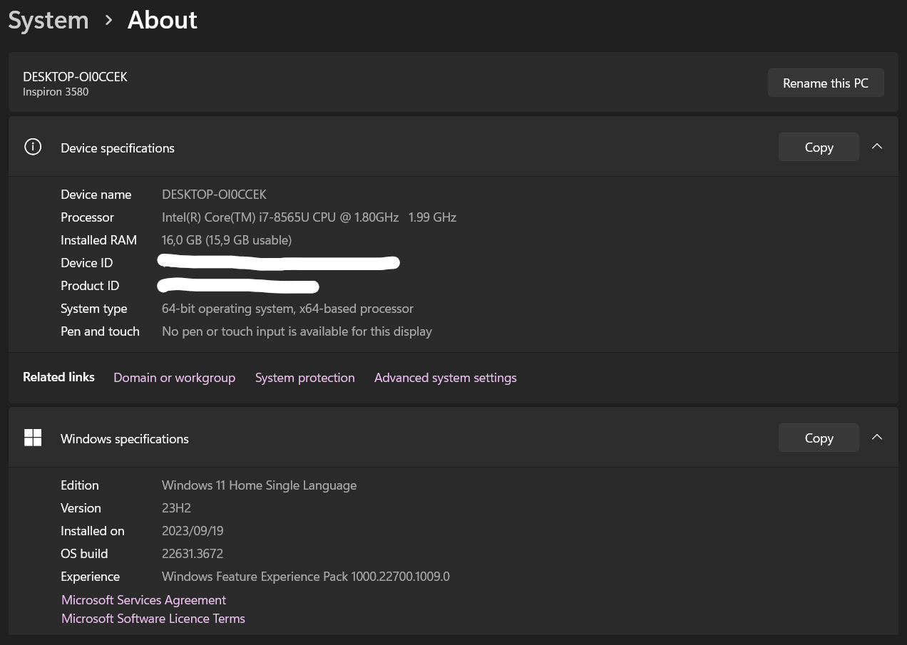

[](https://classroom.github.com/a/vbnbTt5m)
[](https://classroom.github.com/online_ide?assignment_repo_id=15215751&assignment_repo_type=AssignmentRepo)
# Dev_Setup
Setup Development Environment

# Assignment: Setting Up Your Developer Environment

# Objective:
This assignment aims to familiarize you with the tools and configurations necessary to set up an efficient developer environment for software engineering projects. Completing this assignment will give you the skills required to set up a robust and productive workspace conducive to coding, debugging, version control, and collaboration.

# Tasks:

1. Select Your Operating System (OS):
   Choose an operating system that best suits your preferences and project requirements. Download and Install Windows 11. https://www.microsoft.com/software-download/windows11

- Status: Completed




2. Install a Text Editor or Integrated Development Environment (IDE):
   Select and install a text editor or IDE suitable for your programming languages and workflow. Download and Install Visual Studio Code. https://code.visualstudio.com/Download

- Status: Completed


3. Set Up Version Control System:
   Install Git and configure it on your local machine. Create a GitHub account for hosting your repositories. Initialize a Git repository for your project and make your first commit. https://github.com

- Status: Completed
- Git Downloaded and Installation.

   
- GitHub Account Creation.

   
- Git bash launched:

   
   - Configure your Git username and email:
```
 git config --global user.name "Kau-Molepo"
``` 
```
 git config --global user.email "endric.molepo@gmail.com"
```
   - Security Confirmation between github and local machine
- Create a New Repository on GitHub

   
   - New Repository created: Repository name "PLP_Software_Engineering" and its visibility is set to public.
- Connect Your Local Repository to GitHub
   - In Git Bash, navigate to the directory where you want to create your local repository:
      - cd ---> Change directory (must pass the landing directory) 
      ```
        cd B:\PLP\PLP_Software_Engineering\se-assignment-1-setting-up-your-developer-environment-Kau-Molepo
      ```
   - Initialize a new Git repository:
      ```
        git init
      ```
   - Add your new GitHub repository as a remote:
      ```
        git remote add origin https://github.com/Kau-Molepo/PLP_Software_Engineering.git
      ```
   - Security Confirmation between github and local machine
- Add Files and Commit
   -  Create a new file in your repository:
      ```
        echo "This is a read me file as a first file created in Git bash VIM IDE running in CLI mode" > README.md
        #Use nano filename.extention to open an editor for file in editing mode 
      ```
      ```
        echo "Python file for functinalty testing" > Hello.py
        #Use nano filename.extention to open an editor for file in editing mode 
      ```
   - Add the file to the staging area:
      ```
        git add .  #'.' is used to add all files
      ```
   - Commit the file to your repository:
       ```
        git commit -m "This the first commit(created a readme and a python file)"
      ```
- Push to GitHub
   - Push your local commits to the remote repository on GitHub:
      ```
        git push -u origin master
      ```
   - check the status of repository:
      ```
        git status
      ```

4. Install Necessary Programming Languages and Runtimes:
  Instal Python from http://wwww.python.org programming language required for your project and install their respective compilers, interpreters, or runtimes. Ensure you have the necessary tools to build and execute your code.

- Python Installation: I downloaded and installed the latest Python version from the official website, ensuring it was added to my system's PATH.

5. Install Package Managers:
   If applicable, install package managers like pip (Python).

- Pip was installed automatically with Python. I used it to install project-specific packages as needed:
   ```
      pip install <package_name>
   ```
- python libraries installed(Djanko, Flask, Scikit, Numpy, Pandas ...)

6. Configure a Database (MySQL):
   Download and install MySQL database. https://dev.mysql.com/downloads/windows/installer/5.7.html

- MySQL Community Server: I downloaded and installed the MySQL Community Server from the official website.
- MySQL Workbench: I installed MySQL Workbench for database management and administration.

   

7. Set Up Development Environments and Virtualization (Optional):
   Consider using virtualization tools like Docker or virtual machines to isolate project dependencies and ensure consistent environments across different machines.

- Docker: I downloaded and installed Docker from the official website.

   
- Virtual Machines: I downloaded and installed VM from the official website.

   

8. Explore Extensions and Plugins:
   Explore available extensions, plugins, and add-ons for your chosen text editor or IDE to enhance functionality, such as syntax highlighting, linting, code formatting, and version control integration.

- I personalized the appearance and behavior through VS Code's settings.
- I installed the following extensions to enhance my workflow:
   - Python: Provides essential Python language support.
   - GitLens: Integrates Git seamlessly into VS Code.
   - Prettier: Auto-formats code for improved readability.
   

9. Document Your Setup:
    Create a comprehensive document outlining the steps you've taken to set up your developer environment. Include any configurations, customizations, or troubleshooting steps encountered during the process. 
- Referred to Google for minor errors encountered

***
#Deliverables:
- Document detailing the setup process with step-by-step instructions and screenshots where necessary.
- A GitHub repository containing a sample project initialized with Git and any necessary configuration files (e.g., .gitignore).
- A reflection on the challenges faced during setup and strategies employed to overcome them.

#Submission:
Submit your document and GitHub repository link through the designated platform or email to the instructor by the specified deadline.

#Evaluation Criteria:
- Completeness and accuracy of setup documentation.
- Effectiveness of version control implementation.
- Appropriateness of tools selected for the project requirements.
- Clarity of reflection on challenges and solutions encountered.
- Adherence to submission guidelines and deadlines.

Note: Feel free to reach out for clarification or assistance with any aspect of the assignment.
***